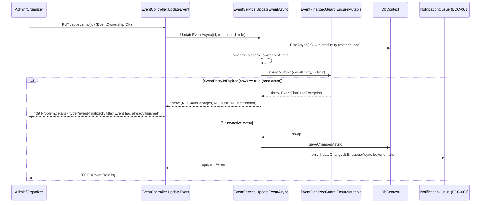
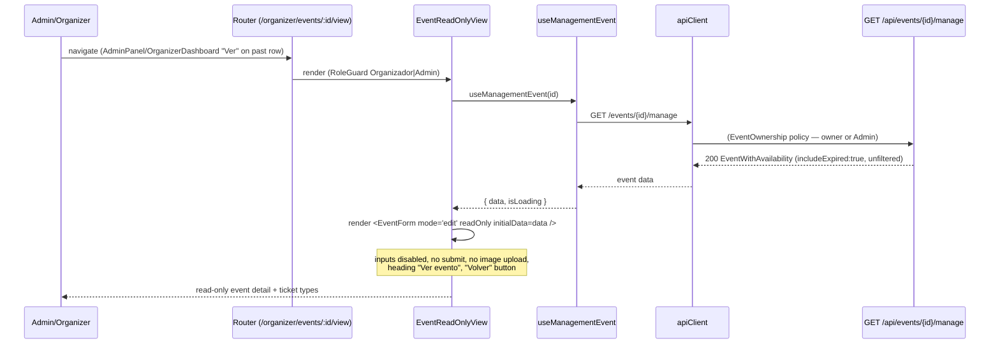

# Design: Past Events Read-Only (Event Immutability)

## Overview & Goals

Freeze mutation of any event whose `Date < server UTC now` for **both** Admin and
Organizer, while keeping consultation (view detail, view purchases) and the payments
carve-out (refunds, purchase views) fully working. Seven mutation endpoints get a single
shared backend guard that throws **before** any save / audit / notification. AdminPanel and
OrganizerDashboard compute `isPast` client-side as cosmetic defense-in-depth and add a
read-only "Ver" consultation view. The rule is **HARD** — independent of the
`HideExpiredEvents` flag (which scopes only to read filters + purchase guards, EHE-009).
Backend is authoritative (EHE-010). No schema change.

## Technical Approach

One shared, pure, unit-tested guard helper evaluates `eventEntity.IsExpired(clock.GetUtcNow().UtcDateTime)`
on the **materialized entity** (never inside `IQueryable` — EF cannot translate `IsExpired`;
ADR-2). Each mutating service method loads the event, calls the guard, then mutates —
`load → guard → mutate` ordering guarantees the guard fires before `SaveChangesAsync` and
before the `UpdateEventAsync` date-change buyer emails (EventService.cs:509-575; EDC-001
path becomes unreachable for past events). `AdminService` gets `TimeProvider` injected,
mirroring `EventService`'s clock pattern (EventService.cs:22/40-48). A new
`EventFinalizedException` is thrown and mapped to 409 Conflict with RFC 7807 `ProblemDetails`
`type: "event-finalized"`, title "Event has already finished" — distinct from the purchase
guard's `event-expired` (EHE-004/005) but the **same shape**, with the same belt-and-suspenders
fallback in `GlobalExceptionHandler`. UI computes `isPast = new Date(event.date) < new Date()`
per row (mirrors EventDetail.jsx:296) to disable mutation buttons and show a "Finalizado"
badge + tooltip; a new `EventReadOnlyView` page reuses `EventForm` in a new `readOnly` mode.

## Architecture Decisions

| # | Decision | Choice | Alternatives | Rationale |
|---|----------|--------|--------------|----------|
| D-1 | Distinct exception type | New `EventFinalizedException` (Models/) → 409 `type: "event-finalized"`, title "Event has already finished". Same RFC 7807 shape as `EventExpiredException` but a different `type` URI. | Reuse `EventExpiredException` (`event-expired` / "already started"). | The two rules share the `IsExpired` predicate but encode different business meanings: purchase-guard = "can't BUY a started event" (temporary purchase lock, flag-gated by EHE-009); mutation-guard = "can't MUTATE a finished event" (permanent immutability, flag-independent). Clients MAY handle them differently; a distinct `type` keeps them separable and the messages honest. One canonical exception per conflict meaning matches the existing ADR-5 pattern. |
| D-2 | Guard placement | **Service layer** — each of the 7 mutating service methods calls the guard after load/ownership, before any write. | Controller-layer guard (check entity date in each action). | The 5 EventService methods already load the entity and own the transaction/lock; guarding there is one round-trip and covers the concurrency boundary (AddTicketStock holds `FOR UPDATE` — the guard must run inside that critical section on the loaded row). AdminService.Approve/Reject load the entity themselves. Controller-only guards would duplicate the load and miss the in-transaction check. ADR-7. |
| D-3 | Shared helper shape | `internal static class EventFinalizedGuard { public static void EnsureMutable(Event e, TimeProvider clock) }` in `backend/Services/Guards/EventFinalizedGuard.cs`. Throws `EventFinalizedException` when `e.IsExpired(clock.GetUtcNow().UtcDateTime)`. Pure, no DI, unit-testable. | Instance method on a registered `IImmutabilityGuard` service; private per-service duplicate. | Both `EventService` and `AdminService` need it; a static helper is the simplest zero-DI reuse and is directly unit-testable (like `Event.IsExpired`). No state, no dependencies beyond the passed clock — no reason to allocate a service. |
| D-4 | Hard rule, flag-independent | Immutability applies regardless of `HideExpiredEvents.Enabled`. | Flag-gate the guard (`if (_hideExpiredOptions.Value.Enabled) guard`). | Same rationale as the scannable window (EventService.cs:215): immutability is a hard business/audit rule, not a display preference. Flag-gating would let a config flip restore mutation of finalized events. ADR-6. |
| D-5 | Read-only "Ver" view | New page `EventReadOnlyView.jsx` at new route `/organizer/events/:id/view` (RoleGuard `['Organizador','Admin']`), reusing `useManagementEvent` (`GET /events/{id}/manage`, includeExpired). Renders `<EventForm mode="edit" readOnly initialData=… />`. "Volver" button instead of submit. | Repurpose public `EventDetail`; new bespoke static page; reuse `OrganizerEventDetail` with a flag. | `EventDetail` is public-only (Approved filter, EventController.cs:46-49) — unusable for admin/organizer past consultation. Reusing `EventForm` with a `readOnly` prop keeps one visual source for event fields and the existing edit-mode ticket-types notice (ATS-008 D-2). One route serves both roles (mirrors how admin "Editar" already cross-roles through `/organizer/events/:id`). ADR-8. |
| D-6 | EventForm read-only mode | New `readOnly` prop: all inputs `disabled`, submit button hidden, image `<input type=file>` hidden (preview shown if `imageUrl`), heading "Ver evento". Reuses the existing edit-mode ticket-types notice block (EventForm.jsx:472-481). | Separate read-only component; disable-only without hiding submit. | Minimal diff on a component that already branches on `isCreate`. Hiding submit + upload removes the "PUT blocked but form still POSTs image" trap (proposal risk). |
| D-7 | Badge + tooltip pattern | Add a `<Badge variant="info">Finalizado</Badge>` next to the status badge on past rows; mutation buttons get `disabled` + a wrapping `title="Evento finalizado — solo lectura"`. Row NOT grayed out (only buttons disabled). | Gray out whole row; single "locked" icon. | Keeps consultation affordances (Compras/Metricas/Ver) visually active; only mutation is disabled. Matches proposal "do not gray out whole row". |
| D-8 | AdminService DI | Add `TimeProvider _clock` to `AdminService` ctor (AdminService.cs:16-20); resolve via existing `AddScoped<IAdminService, AdminService>()` (Program.cs:39) + the `TimeProvider.System` singleton (Program.cs:75). No `Program.cs` registration change. | New `IAdminClock` wrapper. | `TimeProvider` is already the repo-wide clock abstraction (ADR-3); reuse it. DI auto-resolves the singleton into the new ctor parameter. |

## Data Model Impact

**NONE.** `Event.Date` (non-nullable `DateTime`, Models/Event.cs:8) is sufficient. The pure
predicate `Event.IsExpired(DateTime asOf) => Date < asOf` (Models/Event.cs:28, strict `<`,
unit-tested in `EventExpiryTests.cs`) already exists and is EF-safe **outside** queries.
`EventFinalizedException` is a code-only type (not persisted). `AuditActionType` is untouched
(no new mutation actions; approve/reject keep `ApproveEvent`/`RejectEvent`). No migration,
no enum change, no seeded data.

## Sequence Diagrams

### (a) Mutation guard flow — controller → service → guard → 409 (PUT shown; 6 others identical)



### (b) Read-only consultation flow — "Ver" (admin/organizer, past event, no mutation affordances)



## Backend Design

### Shared guard helper (new)

```csharp
// backend/Services/Guards/EventFinalizedGuard.cs
namespace TicketeraOnline.Api.Services.Guards;

/// <summary>Throws <see cref="EventFinalizedException"/> when <paramref name="eventEntity"/>
/// is expired as of <c>clock.GetUtcNow().UtcDateTime</c>. Evaluate on a MATERIALIZED entity
/// only — never inside an IQueryable (EF cannot translate Event.IsExpired). ADR-2/ADR-7.</summary>
internal static class EventFinalizedGuard
{
    public static void EnsureMutable(Event eventEntity, TimeProvider clock)
    {
        if (eventEntity.IsExpired(clock.GetUtcNow().UtcDateTime))
            throw new EventFinalizedException();
    }
}
```

### Exception + GlobalExceptionHandler fallback (mirrors ADR-5 Option (a))

```csharp
// backend/Models/EventFinalizedException.cs (new)
public class EventFinalizedException : Exception
{
    public EventFinalizedException() : base("Event has already finished") { }
}

// backend/Middleware/GlobalExceptionHandler.cs — add to MapException switch:
Models.EventFinalizedException => (StatusCodes.Status409Conflict, "EVENT_FINALIZED",
    "This event has already finished and can no longer be modified."),
// and in TryHandleAsync, next to the existing EventExpiredException special-case (lines 79-83):
if (exception is Models.EventFinalizedException)
{
    problemDetails.Type = "event-finalized";
    problemDetails.Title = "Event has already finished";
}
```

### Service edits (load → guard → mutate; guard throws BEFORE SaveChanges/audit/notification)

| Method (file:line) | Guard insertion point | Side-effects blocked |
|---|---|---|
| `EventService.UpdateEventAsync` (EventService.cs:458) | After ownership (`:476`), before `request.Date` validation (`:485`) | `SaveChangesAsync` (`:503`) + EDC-001 buyer emails (`:509-575`) |
| `EventService.DeleteEventAsync` (`:585`) | After ownership (`:603`), before `Remove` (`:609`) | `SaveChangesAsync` (`:610`) + R2 image cleanup (`:614-622`) |
| `EventService.ReplaceEventImageAsync` (`:727`) | After ownership (`:744`), before `UploadEventImageAsync` (`:748`) | R2 upload + `SaveChangesAsync` (`:752`) + old-image delete |
| `EventService.AddTicketStockAsync` (`:290`) | After TT load (`:339`), before `Quantity +=` (`:345`) — **inside** the `FOR UPDATE` txn | `SaveChangesAsync` (`:346`) |
| `EventService.AddTicketTypeAsync` (`:368`) | After event load (`:382`), before validation/insert (`:415`) — inside txn | `SaveChangesAsync` (`:416`) |
| `AdminService.ApproveEventAsync` (AdminService.cs:104) | After load (`:107`), before `Status = Approved` (`:109`) | `SaveChangesAsync` (`:110`) |
| `AdminService.RejectEventAsync` (`:121`) | After load (`:124`), before `Status = Rejected` (`:126`) | `SaveChangesAsync` (`:127`) |

> **AddTicketType frozen too** — both it and AddTicketStock modify capacity (proposal risk).
> **Guard ordering**: every guard runs before `SaveChangesAsync` and before any audit call
> (audits happen in the controllers AFTER the service returns; a thrown exception never
> reaches the audit line). For `UpdateEventAsync` the guard also precedes the notification
> enqueue, so EDC-001 cannot fire for a past event.

### Controller catch mapping (add `catch (EventFinalizedException)` ABOVE the generic catch)

Each of the 7 actions adds, before its generic `catch (Exception)`:

```csharp
catch (EventFinalizedException)
{
    return Problem(
        detail: "This event has already finished and can no longer be modified.",
        statusCode: 409,
        title: "Event has already finished",
        type: "event-finalized");
}
```

Touches: `EventController.UpdateEvent` (`:146`), `DeleteEvent` (`:186`), `UploadEventImage`
(`:232`); `AdminController.AddTicketStock` (`:198`), `AddTicketType` (`:222`), `ApproveEvent`
(`:328`), `RejectEvent` (`:366`). The class-level `RequireAdminRole` (AdminController.cs:14)
and `EventOwnership` (EventController.cs:119/167/203) policies are unchanged — 403/401 paths
are unaffected.

### DI changes

- `AdminService` ctor: `public AdminService(ApplicationDbContext context, ILogger<AdminService> logger, TimeProvider timeProvider)`; store `_clock = timeProvider` (AdminService.cs:16-20).
- `Program.cs`: **no change** — `AddScoped<IAdminService, AdminService>()` (`:39`) auto-resolves the existing `TimeProvider.System` singleton (`:75`).
- Tests: update any direct `new AdminService(...)` construction (e.g. a new `AdminServiceTests`) to pass a `FakeTimeProvider`; `AdminControllerTests` uses `Mock<IAdminService>` so it is unaffected.

## Frontend Design

### `isPast` computation (per row, UTC, mirrors EventDetail.jsx:296)

- AdminPanel (`events.map`): `const isPast = new Date(event.date) < new Date()` (event.date is the ISO UTC DateTime from `EventSummary`, AdminService.cs:81).
- OrganizerDashboard (`metrics.map`): `const isPast = new Date(m.eventDate) < new Date()`.

### AdminPanel.jsx (row actions, `:383-445`)

- Add "Ver" button → `navigate(\`/organizer/events/${event.id}/view\`)`. Shown for **all** events (past + future) as the consultation entry; for past events it is the primary affordance.
- Disable (add `disabled={isPast || busyApprovalId === event.id}`) on: Aprobar (`:385`), Rechazar (`:397`), Agregar entradas (`:409`), Editar (`:427`), Eliminar (`:436`). Each disabled mutation button wrapped with `title="Evento finalizado — solo lectura"`.
- Keep **Compras** (`:418`) always enabled (payments carve-out).
- Add `<Badge variant="info">Finalizado</Badge>` in the Estado cell (`:378-382`) next to the status badge when `isPast`.
- Do **NOT** gray out the row (`<tr>` className unchanged).

### OrganizerDashboard.jsx (row actions, `:228-259`)

- Add "Ver" button → `navigate(\`/organizer/events/${m.eventId}/view\`)`.
- Disable Editar (`:230`, already admin-only via `canEdit`) and Eliminar (`:250`) when `isPast` (+ tooltip).
- Keep **Metricas** (`:241`) always enabled.
- Add "Finalizado" badge when `isPast`.

### EventReadOnlyView.jsx (new page) + route

```jsx
// frontend/src/pages/EventReadOnlyView.jsx
export default function EventReadOnlyView() {
  const { id } = useParams()
  const navigate = useNavigate()
  const { data, isLoading, isError, error } = useManagementEvent(id)
  // loading / error states mirror OrganizerEventDetail.jsx:31-52
  return (
    <motion.div ...>
      <h1>...Ver evento...</h1>
      {data && <EventForm mode="edit" readOnly initialData={data}
        onSuccess={() => navigate(-1)} />}
      <Button variant="secondary" onClick={() => navigate(-1)}>Volver</Button>
    </motion.div>
  )
}
```

Route in `App.jsx` (after `/organizer/events/:id/metrics`, before `/organizer/events/:id`):

```jsx
<Route path="/organizer/events/:id/view" element={
  <ProtectedRoute><RoleGuard allowedRoles={['Organizador','Admin']}>
    <EventReadOnlyView />
  </RoleGuard></ProtectedRoute>
} />
```

(`/organizer/events/:id/view` is a distinct 3-segment route; `:id` matches one segment, so no collision with `/organizer/events/:id` or `.../:id/metrics`.)

### EventForm.jsx — `readOnly` prop (D-6)

- Add `readOnly` to props (default `false`).
- Every input/textarea/select: `disabled={submitting || readOnly}`.
- Hide the image `<input type="file">` block when `readOnly` (keep the preview `` if `imagePreview`).
- Hide the submit `<div className="form-actions">` (`:483`) when `readOnly`.
- Edit-mode ticket-types notice (`:472-481`) already renders as static text — fine for read-only.
- Heading is the page's responsibility (`EventReadOnlyView` shows "Ver evento"; `OrganizerEventDetail` keeps "Editar evento").

### Design-system tokens used

`Badge` (existing `info` variant), `Button` variants (`secondary` for Ver, `danger`/`primary` for disabled mutations), `GlassCard`, `motion.js` `fadeIn` for the page entrance. No new tokens needed; semantic classes (`text-text-2`, `border-border`) already in use on these pages.

## API / Contract Changes

New 409 Conflict response on all 7 mutation endpoints when the target event's `Date < server UTC now`:

```json
HTTP/1.1 409 Conflict
Content-Type: application/problem+json
{
  "type": "event-finalized",
  "title": "Event has already finished",
  "status": 409,
  "detail": "This event has already finished and can no longer be modified.",
  "instance": "/api/events/{id}"
}
```

Same RFC 7807 shape as the purchase-guard 409 (`event-expired`, EHE-004/005) — clients already
deserialize `ProblemDetails`; the new `type` URI is the only contract delta. No new endpoints,
no DTO changes, no success-shape changes. `GET /events/{id}/manage` (consultation) is unchanged.

## File Changes

| File | Action | Description |
|------|--------|-------------|
| `backend/Models/EventFinalizedException.cs` | Create | New exception → 409 `event-finalized` (D-1). |
| `backend/Services/Guards/EventFinalizedGuard.cs` | Create | Shared static `EnsureMutable(Event, TimeProvider)` helper (D-3). |
| `backend/Services/EventService.cs` | Modify | Call guard in `UpdateEventAsync`, `DeleteEventAsync`, `ReplaceEventImageAsync`, `AddTicketStockAsync`, `AddTicketTypeAsync` (5 insertions per table above). |
| `backend/Services/AdminService.cs` | Modify | Inject `TimeProvider`; call guard in `ApproveEventAsync`, `RejectEventAsync` (D-8). |
| `backend/Controllers/EventController.cs` | Modify | Add `catch (EventFinalizedException) → Problem(409, "event-finalized")` in Update/Delete/Image (above generic catch). |
| `backend/Controllers/AdminController.cs` | Modify | Same catch in AddTicketStock/AddTicketType/Approve/Reject (above generic catch). |
| `backend/Middleware/GlobalExceptionHandler.cs` | Modify | `MapException` case + `TryHandleAsync` special-case for `EventFinalizedException` (belt-and-suspenders, ADR-5 Option (a) pattern). |
| `frontend/src/pages/EventReadOnlyView.jsx` | Create | Read-only consultation page reusing `useManagementEvent` + `EventForm readOnly` (D-5). |
| `frontend/src/components/EventForm.jsx` | Modify | Add `readOnly` prop: disable inputs, hide submit + file input (D-6). |
| `frontend/src/pages/AdminPanel.jsx` | Modify | `isPast` per row; "Ver" action; disable 5 mutations + tooltip; "Finalizado" badge; keep Compras (D-7). |
| `frontend/src/pages/OrganizerDashboard.jsx` | Modify | `isPast` per row; "Ver" action; disable Editar/Eliminar + tooltip; "Finalizado" badge; keep Metricas. |
| `frontend/src/App.jsx` | Modify | Add `/organizer/events/:id/view` route (D-5). |
| `backend/Tests/EventFinalizedGuardTests.cs` | Create | Pure helper unit tests (expired throws, active no-op, exact-instant no-op). |
| `backend/Tests/EventServiceImmutabilityTests.cs` | Create | Service-level: each of 5 EventService methods throws `EventFinalizedException` on past event + no persistence (FakeTimeProvider, InMemory). |
| `backend/Tests/AdminServiceTests.cs` | Create | Service-level: Approve/Reject throw on past event + no status flip (FakeTimeProvider); active event still flips. |
| `backend/Tests/EventControllerTests.cs` | Modify | HTTP integration (EventCatalogApiFactory): each of 7 endpoints → 409 + JSON `type:"event-finalized"` on a seeded past event. Must-stay-green assertions preserved. |
| `backend/Tests/AdminControllerTests.cs` | Modify | Mocked `IAdminService`/`IEventService` `.ThrowsAsync(new EventFinalizedException())` → assert `Problem(409, "event-finalized")` for Approve/Reject/AddTicketStock/AddTicketType (mirror ReservationControllerTests:166). |
| `backend/Tests/ErrorHandlingPropertyTests.cs` | Modify | `GlobalExceptionHandler_EventFinalizedException_PayloadHasTypeEventFinalized` (mirror `:206`). |

## Testing Strategy

Strict TDD (backend) — `openspec/config.yaml` `apply.tdd: true`, `test_command: dotnet test`.

| Layer | What to Test | Approach |
|-------|-------------|----------|
| Unit (guard) | `EventFinalizedGuard.EnsureMutable`: expired → throws `EventFinalizedException`; active + exact-instant → no-op | xUnit, pure (no DB), `FakeTimeProvider` |
| Unit (service) | Each of 5 `EventService` methods + `AdminService.Approve/Reject` throws on a past-dated entity; **no** `SaveChanges` effect (no status flip, no `Quantity` change, no row, no notification enqueue) | InMemory `ApplicationDbContext` + `FakeTimeProvider` frozen at `T`; seed event at `T-2d`; assert throw + assert DB unchanged + `_mockNotificationQueue.Verify(EnqueueAsync, Never)` for Update. Mirror `CreateServiceWithClockAndOptions` (EventServiceTests.cs:975). |
| Unit (controller) | All 7 actions translate `EventFinalizedException` → `Problem(409, type:"event-finalized")` and write **no** audit | `Mock<IEventService>`/`Mock<IAdminService>` `.ThrowsAsync(new EventFinalizedException())`; assert `ProblemDetails` (mirror ReservationControllerTests:166/PaymentControllerTests:127); `Mock<IAuditLogService>.Verify(LogActionAsync, Never)`. |
| Integration (HTTP) | Real pipeline: seed past event (frozen clock), login admin/organizer, hit each of 7 endpoints → 409 `application/problem+json` with `type:"event-finalized"`; consultation GET `/events/{id}/manage` → 200 | `EventCatalogApiFactory` (frozen `Clock`, EventControllerTests.cs:472-483) + `CreateClientWithCookie`. Assert JSON `type` field explicitly. |
| Fallback | `GlobalExceptionHandler` payload for an escaped `EventFinalizedException` carries `type:"event-finalized"`, title "Event has already finished", 409 | `ErrorHandlingPropertyTests` pattern (`:206`). |
| Must-stay-green | `GetEventById_ManagementIncludeExpired_200` (EventControllerTests.cs:358), `Organizer_ManagementEvent_Expired_200` (`:379`); all existing future-date Update/Delete/Approve/Reject/stock tests; purchase-guards (EHE-004/005); refunds (APR-*) | Unchanged fixtures (future dates via `Clock.GetUtcNow().AddDays(30/60)`); run full `dotnet test`. |
| Frontend | No test runner configured (config.yaml: `notes`) — manual verification: "Ver" renders read-only, mutation buttons disabled with tooltip, "Finalizado" badge, Compras/Metricas still navigate. | Manual + follow-up (deferred, ATS-009 precedent). |

## Threat Matrix

N/A — no routing, shell, subprocess, VCS/PR automation, executable-file classification, or
process-integration boundary. The change adds a guard call inside 7 existing `[ApiController]`
actions (no new backend routes, no `Process.Start`, no dynamic routing) and one new **frontend**
route. No threat-matrix rows apply.

## Migration / Rollout

No migration required. Purely additive: one exception type, one guard helper, 7 service guard
calls, 7 controller catches, one GlobalExceptionHandler case, one DI ctor parameter, one new
page + one EventForm prop + 3 UI edits + 1 route. Rollback is `git revert <sha>` — removes the
guard calls, the `TimeProvider` injection on `AdminService`, the consultation view, and the UI
disable/badge; existing mutation/consultation flows return to today's behavior. The rule is
HARD (no flag), so rollback is code revert only — no DB cleanup, no flag toggle.

## Risks and Decisions (with rationale)

| Risk | Mitigation |
|---|---|
| **Timezone boundary**: client `isPast` (`new Date()`) vs server UTC | Backend guard is authoritative (EHE-010); UI disable is cosmetic defense-in-depth. Both compare in UTC (`event.date` is a UTC DateTime serialized as ISO Z; `new Date()` is UTC-based). A past event that the UI mis-classifies is still rejected by the backend with 409. |
| **AddTicketType not frozen** (only stock frozen) | Freeze BOTH — both modify capacity (D-2 table, AddTicketType row). Confirmed in proposal. |
| **Guard runs after save/notification** (EDC-001 buyer emails leak) | Guard inserted AFTER ownership, BEFORE `SaveChangesAsync` and the `if (dateChanged)` notification block (EventService.cs:476→485→503→509). Load → guard → mutate ordering is explicit in the service-edit table. RED test asserts `_mockNotificationQueue.Verify(EnqueueAsync, Never)` for a past-event Update. |
| **`IsExpired` called inside `IQueryable`** (EF can't translate) | Helper evaluates on the **materialized** entity only (`FindAsync` / `FirstOrDefaultAsync` result), never in a `Where` predicate (ADR-2). |
| **`AdminService` has no clock today** | Inject `TimeProvider` (D-8); reuse `TimeProvider.System` singleton (Program.cs:75); tests use `FakeTimeProvider`. |
| **GET on past events breaks** (consultation carve-out) | Guard applies to MUTATION only; `GET /events/{id}/manage` (includeExpired) and `/admin/events/{id}/purchases` untouched. `GetEventById_ManagementIncludeExpired_200` + `Organizer_ManagementEvent_Expired_200` must stay green (explicit regression assertions). |
| **Payments carve-out breaks** | `AdminPurchaseService` (refunds, purchases) is a separate service, untouched. `RefundPurchase` maps `InvalidOperationException`→409 (AdminController.cs:293) — unrelated to `EventFinalizedException`. |
| **PUT blocked → EventForm still POSTs image** | `readOnly` mode hides the file input AND the submit button (D-6); the image POST only runs after a successful PUT in `handleSubmit` (EventForm.jsx:165-169), so a 409 short-circuits before it. |
| **Reviewer load** (7 endpoints + 2 surfaces + new view + helper) | Forecast in sdd-tasks; recommend chained PRs (slice 1: backend guard + exception + tests; slice 2: consultation view + EventForm readOnly; slice 3: AdminPanel/OrganizerDashboard UI). Honors the 400-line review budget. |

## Architecture Decision Log

### ADR-6 — Hard immutability rule, independent of `HideExpiredEvents`

**Choice**: The past-event immutability rule is HARD — it applies regardless of
`HideExpiredEvents.Enabled`.
**Alternatives considered**: Flag-gate the guard (`if (_hideExpiredOptions.Value.Enabled) EnsureMutable(...)`).
**Rationale**: `HideExpiredEvents` scopes only to read filters (EHE-002/003) and purchase guards
(EHE-004/005) — display/purchase concerns, per ADR-4. Immutability of a finalized event is a
hard business/audit rule (an admin must not rewrite history of a past event's content, capacity,
or approval), not a display preference. Flag-gating would let an operator flip a config and
restore mutation of finalized events, defeating the rule. Same reasoning as the scannable
window (EventService.cs:215, "hard technical rule — applies regardless of the flag"). No
runtime toggle; rollback is code revert only.

### ADR-7 — Guard at the service layer, not the controller

**Choice**: Each mutating **service** method calls `EventFinalizedGuard.EnsureMutable` after
load/ownership, before any write.
**Alternatives considered**: Guard in each controller action (load entity, check date, then call
service); guard in an action filter / authorization handler.
**Rationale**: (1) The 5 `EventService` methods already load the entity and own the
transaction/row-lock — `AddTicketStockAsync` holds `FOR UPDATE` (EventService.cs:313-337); the
guard must run **inside** that critical section on the loaded row, else a race opens between
the controller's check and the locked write. (2) `AdminService.Approve/Reject` load the entity
themselves — guarding there is one round-trip. (3) A controller/filter guard would duplicate
the load and still need an in-transaction check, splitting one rule across two layers. (4)
Service-layer guarding matches the proven purchase-guard placement (ReservationService.cs:163,
PaymentService.cs:137) — one consistent seam. Controllers only translate the typed exception to
409 (their existing responsibility per ADR-5).

### ADR-8 — Read-only consultation view: new page + `EventForm readOnly` prop

**Choice**: New `EventReadOnlyView.jsx` at `/organizer/events/:id/view` (RoleGuard
`['Organizador','Admin']`), fed by `useManagementEvent` (`GET /events/{id}/manage`,
includeExpired), rendering `<EventForm mode="edit" readOnly />`.
**Alternatives considered**: (a) Repurpose public `EventDetail`; (b) a bespoke static
consultation component; (c) reuse `OrganizerEventDetail` with a `readOnly` flag.
**Rationale**: (a) is unusable — `EventDetail` calls `GET /events/{id}` which 404s non-Approved
events (EventController.cs:46-49) and is anonymous/public; admin/organizer past events are
often `Pending`/`Rejected` and must not be public. (b) duplicates the event-field layout for no
gain. (c) overloads the edit route (`/organizer/events/:id`) with a second mode, muddying
"Editar" vs "Ver" and risking the edit path leaking mutation affordances. A **distinct route**
for consultation + a **distinct page** that reuses `EventForm` via a `readOnly` prop keeps one
visual source for event fields, reuses the existing edit-mode ticket-types notice (ATS-008
D-2), and cleanly separates "view" from "edit". One route serves both roles — mirrors how
admin "Editar" already cross-roles through `/organizer/events/:id` (AdminPanel.jsx:430). The
`EventForm` `readOnly` prop (D-6) disables all inputs, hides submit + image upload, closing the
"PUT blocked but image still POSTs" trap.

## Open Questions

- [ ] None blocking. (Follow-up: add a frontend test runner so the "Ver"/disabled-button UI can
  get Vitest coverage — deferred per config.yaml `notes`, same precedent as ATS-009 D-9.)
